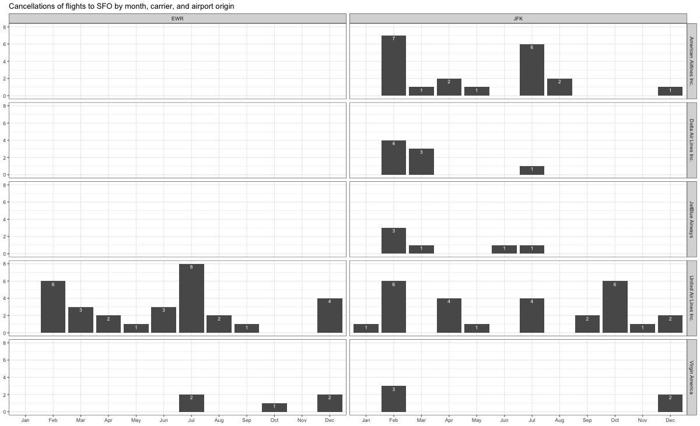

```{r}
#| label: load-libraries
#| echo: false # This option disables the printing of code (only output is displayed).
#| message: false
#| warning: false

library(tidyverse)
library(nycflights13)
library(skimr)

```

# Data Manipulation `nycflights13`

## Problem 1: What months had the highest and lowest proportion of cancelled flights? Interpret any seasonal patterns.

To determine if a flight was cancelled use the following code

```{r}

# What months had the highest and lowest % of cancelled flights?

pct_share <- flights %>% 
  filter(is.na(dep_time)) %>% 
  group_by(month) %>% 
  summarise(Count = n()) %>% 
  mutate(pct_share = Count * 100 / sum(Count)) %>% 
  arrange(desc(pct_share))

print(pct_share)
```

## Problem 2: What plane (specified by the `tailnum` variable) traveled the most times from New York City airports in 2013?

For the plane with the greatest number of flights and that had more than 50 seats, please create a table where it flew to during 2013.

```{r}
most_flown <- flights %>%
  group_by(tailnum) %>% 
  summarise(count = n()) %>% 
  arrange(desc(count)) %>% 
  left_join(planes, by = "tailnum") %>% 
  filter(!is.na(tailnum))
  
print(most_flown)
```

```{r}
most_flown_dest_2013 <- most_flown %>% 
  filter(seats > 50) %>% 
  head(1) %>% 
  left_join(flights, by = "tailnum") %>% 
  group_by(carrier, dest) %>% 
  count()

print(most_flown_dest_2013)
```

## Problem 3: Use the `flights` and `planes` tables to answer the following questions:

```         
-   How many planes have a missing date of manufacture?
-   What are the five most common manufacturers?
-   Has the distribution of manufacturer changed over time as reflected by the airplanes flying from NYC in 2013? (Hint: you may need to use case_when() to recode the manufacturer name and collapse rare vendors into a category called Other.)
```

\- How many planes have a missing date of manufacture?

```{r}
# Missing date of manufacture
missing_year <- planes %>% 
  filter(is.na(year)) %>% 
  count()
print(missing_year)

# Cleaning the dataset - combining same manufacturers, adding an others category
planes_clean <- planes %>%
  mutate(
    manufacturer = case_when(
    manufacturer == 'BOEING' ~ 'BOEING', 
    manufacturer == 'AIRBUS' ~ 'AIRBUS', 
    manufacturer == 'AIRBUS INDUSTRIE' ~ 'AIRBUS', 
    manufacturer == 'EMBRAER' ~ 'EMBRAER', 
    manufacturer == 'BOMBARDIER INC' ~ 'BOMBARDIER INC', 
    manufacturer == 'MCDONNELL DOUGLAS' ~ 'MCDONNELL DOUGLAS', 
    manufacturer == 'MCDONNELL DOUGLAS AIRCRAFT CO' ~ 'MCDONNELL DOUGLAS', 
    manufacturer == 'MCDONNELL DOUGLAS CORPORATION' ~ 'MCDONNELL DOUGLAS',
    TRUE ~ 'OTHER'
    )
  )

# Most common manufacturers
common_manuf <- planes_clean %>% 
  count(manufacturer, sort = TRUE) %>% 
  head(5)
print(common_manuf)

# Manufacturer distribution
manuf_dist <- planes_clean %>% 
  left_join(flights, by = 'tailnum') %>% 
  group_by(month, manufacturer) %>% 
  summarise(count = n())
print(manuf_dist)
  

```

```         
```

## Problem 4: Which carriers service the route to San Francisco International (SFO).

```{r}
fly_into_sfo <- flights %>% 
  filter(dest == 'SFO') %>% 
  count(carrier, sort = TRUE) %>% 
  left_join(airlines, by = 'carrier') %>% 
  mutate( pct = n / sum(n)) %>% 
  select(name, n, pct)
print(fly_into_sfo)
```

And here is some bonus ggplot code to plot your dataframe

```{r}
#| label: ggplot-flights-toSFO
#| message: false
#| warning: false
#| eval: false


sfo_plot <- fly_into_sfo %>% 
  
  # sort 'name' of airline by the numbers it times to flew to SFO
  mutate(name = fct_reorder(name, n)) %>% 
  
  ggplot() + 
  
  aes(x = n, 
      y = name) +
  
  # a simple bar/column plot
  geom_col() +
  
  # add labels, so each bar shows the % of total flights 
  geom_text(aes(label = pct),
             hjust = 1, 
             colour = "white", 
             size = 3)+
  
  # add labels to help our audience  
  labs(title="Which airline dominates the NYC to SFO route?", 
       subtitle = "as % of total flights in 2013",
       x= "Number of flights",
       y= NULL) +
  
  theme_bw() + 
  
  # change the theme-- i just googled those , but you can use the ggThemeAssist add-in
  # https://cran.r-project.org/web/packages/ggThemeAssist/index.html
  
  theme(#
    # so title is left-aligned
    plot.title.position = "plot",
    
    # text in axes appears larger        
    axis.text = element_text(size=12),
    
    # title text is bigger
    plot.title = element_text(size=18)
      ) +

  # add one final layer of NULL, so if you comment out any lines
  # you never end up with a hanging `+` that awaits another ggplot layer
  NULL
 
print(sfo_plot)
```

## Problem 5: Cancellations of flights to SFO.

We create a new dataframe `cancellations` as follows

```{r}

cancellations <- flights %>% 
  
  # just filter for destination == 'SFO'
  filter(dest == 'SFO') %>% 
  
  # a cancelled flight is one with no `dep_time` 
  filter(is.na(dep_time))

```

I want you to think how we would organise our data manipulation to create the following plot. No need to write the code, just explain in words how you would go about it.



To recreate the graph starting with the cancellations dataset, I would:

1.  **Group and Summarize**:

    -   Group the filtered data by **`month`**, **`carrier`**, and **`origin`**.

    -   Summarize the grouped data to count the number of cancellations within each group.

2.  **Prepare Data for Plotting**:

    -   Convert **`month`** to a factor to ensure the months are plotted in order.

3.  **Plot the Data**:

    -   Use **`ggplot`** to create a bar plot.

    -   Map **`month`** to the x-axis and the count of cancellations to the y-axis.

    -   Use **`facet_grid`** to create separate panels for each origin airport.

    -   Use **`geom_bar`** to create the bar plot

# Rents in San Francsisco 2000-2018

```{r}
# download directly off tidytuesdaygithub repo

rent <- readr::read_csv('https://raw.githubusercontent.com/rfordatascience/tidytuesday/master/data/2022/2022-07-05/rent.csv')

```

What are the variable types? Do they all correspond to what they really are? Which variables have most missing values?

```{r skim_data}
# YOUR CODE GOES HERE
skimr::skim(rent)

```

Make a plot that shows the top 20 cities in terms of % of classifieds between 2000-2018. You need to calculate the number of listings by city, and then convert that number to a %.

The final graph should look like this

```{r, echo=FALSE, out.width="90%"}
knitr::include_graphics(here::here("images", "top_cities.png"), error = FALSE)
```

```{r top_cities}
# YOUR CODE GOES HERE
rent %>% 
  count(city, sort = TRUE) %>% 
  head(20) %>% 
  mutate(
    pct = n / sum(n),
    city = fct_reorder(city, pct)
    ) %>% 
  
  ggplot() +
  aes(x = pct, y = city) +
  geom_col() +
  scale_x_continuous( labels = scales::percent_format()) +
  labs(
    title = "San Francisco accounts for more than a quarter of all rental classifieds",
    subtitle = "Percentage of Craigslist listings, 2000-2018",
    caption = "Source: Pennington, Kate (2018). Bay Area Craigslist Rental Housing  Posts, 2000-2018",
    x = NULL,  # Removes the 'pct' label on x-axis
    y = NULL   # Removes the 'city' label on y-axis
  ) +
  theme_minimal() +
    theme(
    plot.title = element_text(size = 10, hjust = 0),
    plot.subtitle = element_text(size = 8, hjust = 0),
    plot.caption = element_text(size = 6)
  )
  
  
```

Make a plot that shows the evolution of median prices in San Francisco for 0, 1, 2, and 3 bedrooms listings. The final graph should look like this

```{r, echo=FALSE, out.width="90%"}
knitr::include_graphics(here::here("images", "sf_rentals.png"), error = FALSE)
```

```{r sf_median_prices}

# YOUR CODE GOES HERE
rent %>% 
  group_by(beds, year) %>% 
  summarise(median_price = mean(price, na.rm = TRUE)) %>% 
  filter(beds %in% c(0,1,2,3)) %>% 
  ggplot() +
  aes(x = year, y = median_price, color = as.factor(beds)) +
  geom_line() +
  facet_wrap(~beds, ncol = 4) +
  theme_bw() +
  labs(
    title = 'San Francisco rents have been steadily increasing',
    subtitle = '0 to 3-bed listings, 2000-2018', 
    caption = 'Source: Pennington, Kate (2018). Bay Area Craigslist Rental Housing Posts, 2000-2018', 
    x = NULL, 
    y = NULL
  ) +
  theme(
    legend.position = "none",
    plot.title = element_text(size = 10, hjust = 0, margin = margin(t = 0, b = 3, l = 0)),
    plot.subtitle = element_text(size = 8, hjust = 0, margin = margin(t = 0, b = 3, l = 0)),
    plot.caption = element_text(size = 6)
  )
  

```

Finally, make a plot that shows median rental prices for one-bed flats in the top 12 cities in the Bay area. Your final graph should look like this

```{r, echo=FALSE, out.width="90%"}
knitr::include_graphics(here::here("images", "one_bed_bay_area.png"), error = FALSE)
```

```{r spirit_plot}
# YOUR CODE GOES HERE
bay_area = c('berkeley', 'mountain view', 'oakland', 'palo alto', 'san francisco', 'san jose', 'san mateo', 'santa clara', 'santa cruz', 'santa rosa', 'sunnyvale', 'union city')

rent %>% 
  filter(city %in% bay_area, beds == 1) %>% 
  group_by(city, year) %>% 
  summarise(median_price = median(price)) %>% 
  ggplot() +
  aes(x = year, y = median_price, color = city) + 
  geom_line() +
  facet_wrap(~city, ncol = 4) +
  theme_bw() +
  labs(
    title = 'Rental prices for 1-bedroom flats in the Bay Area',
    caption = 'Source: Pennington, Kate (2018). Bay Area Craigslist Rental Housing Posts, 2000-2018', 
    x = NULL, 
    y = NULL
  ) +
  theme(
    legend.position = "none",
    plot.title = element_text(size = 10, hjust = 0, margin = margin(t = 0, b = 3, l = 0)),
    plot.subtitle = element_text(size = 8, hjust = 0, margin = margin(t = 0, b = 3, l = 0)),
    plot.caption = element_text(size = 6)
  )
```

What can you infer from these plots? Don't just explain what's in the graph, but speculate or tell a short story (1-2 paragraphs max).

With over 25% of all Craigslist rental listings between 2000 and 2018, San Francisco is evidently the dominant rental market in the Bay Area, according to the visualizations. This significant presence points to a very active rental market, probably caused by strong demand and a steady stream of people looking for property in the city---possibly as a result of its reputation as a center of culture and technology.\
The second plot emphasizes a clear rising trend from 2000 to 2018, showing a consistent rise in rental prices across different numbers of bedrooms. This pattern highlights San Francisco's rising cost of living and reflects the city's larger problems with gentrification and economic expansion.

The final plot, which compares rental costs for one-bedroom apartments in various locations, shows that although growth occurred in all of the cities, it did so at different rates and with variable consistency. Certain cities, like Oakland and Palo Alto, exhibit greater volatility, whereas cities like San Francisco and San Jose show steady and dramatic increases, indicating ongoing demand. This suggests that economic pressures and housing demand vary by geography, with certain cities experiencing more acute pressures from the housing market than others.

## Challenge

How would you go about creating this?

```{r, echo=FALSE, out.width="90%"}
knitr::include_graphics(here::here("images", "challenge1.png"), error = FALSE)
```

> TYPE YOUR ANSWER AFTER (AND OUTSIDE!) THIS BLOCKQUOTE.

```{r}
median_rent <- rent %>% 
  filter(city %in% bay_area, beds %in% c(0,1,2)) %>% 
  group_by(city, beds, year) %>%
  summarise(median_price = median(price, na.rm = TRUE)) %>% 
  mutate(
    pct_change = (median_price / first(median_price))
  )

ggplot(median_rent, aes(x = year, y = pct_change, color = city)) +
  geom_line() +  # Draw lines
  facet_grid(beds ~ city, scales = "free_y") +  # Facet by city and beds, free y-axis scaling
  scale_y_continuous(labels = scales::percent_format()) +
  labs(
    title = "Cumulative % change in 0, 1, and 2-bed rentals in Bay Area",
    subtitle = "2000-2018",
    x = NULL,
    y = NULL
  ) +
  theme_bw() +  # Use a minimal theme
  theme(
    plot.title = element_text(hjust = 0, size = 10),  
    plot.subtitle = element_text(hjust = 0, size = 8),
    axis.text.x = element_text(angle = 90, vjust = 0.5, hjust = 1),
    legend.position = "none"  # Hide legend
  )
```

# On your own -- Hollywood Age Gap

```{r}

age_gaps <- readr::read_csv('https://raw.githubusercontent.com/rfordatascience/tidytuesday/master/data/2023/2023-02-14/age_gaps.csv')


```

How would you explore this data set? Here are some ideas of tables/ graphs to help you with your analysis

-   How is `age_difference` distributed? What's the 'typical' `age_difference` in movies?

```{r}
age_gaps %>% 
  ggplot() +
  aes(x = age_difference) +
  geom_histogram() +
  theme_bw() +
  labs(
    x = 'Age Difference',
    y = NULL,
    title = 'Age difference distribution'
  )
```

-   The `half plus seven\` rule. Large age disparities in relationships carry certain stigmas. One popular rule of thumb is the [half-your-age-plus-seven](https://en.wikipedia.org/wiki/Age_disparity_in_sexual_relationships#The_.22half-your-age-plus-seven.22_rule) rule. This rule states you should never date anyone under half your age plus seven, establishing a minimum boundary on whom one can date. In order for a dating relationship to be acceptable under this rule, your partner's age must be:

$$\frac{\text{Your age}}{2} + 7 < \text{Partner Age} < (\text{Your age} - 7) * 2$$ How frequently does this rule apply in this dataset?

```{r}
age_diff_followed <- age_gaps %>%
  mutate(
    min_acceptable_age = actor_1_age / 2 + 7,
    max_acceptable_age = (actor_1_age - 7) * 2,
    follows_rule = actor_2_age >= min_acceptable_age & actor_2_age <= max_acceptable_age
  )
age_diff_followed %>% 
  filter(follows_rule == TRUE) %>% 
  group_by(release_year) %>% 
  ggplot() +
  aes(x = release_year) +
  geom_bar() + 
  theme_bw()
  

# Summarize the results
summary <- age_diff_followed %>%
  summarise(
    total_couples = n(),
    couples_following_rule = sum(follows_rule),
    proportion_following_rule = mean(follows_rule)
  )

print(summary)
```

-   Which movie has the greatest number of love interests?

```{r}
movie_couples <- age_gaps %>%
  group_by(movie_name) %>%
  summarise(love_interests = n())

# Find the movie with the greatest number of love interests
movie_with_most_love_interests <- movie_couples %>%
  arrange(desc(love_interests)) %>%
  slice(1)

# Print the result
print(movie_with_most_love_interests)

```

-   Which actors/ actresses have the greatest number of love interests in this dataset?

```{r}
# Combine actor_1 and actor_2 into a unified format for counting love interests
love_interests <- age_gaps %>%
  select(actor_1_name, actor_2_name, movie_name, couple_number) %>%
  gather(key = "actor_role", value = "actor_name", actor_1_name, actor_2_name) %>%
  distinct(actor_name, movie_name, couple_number)

# Group by actor_name and count the number of unique love interests
actor_love_interests <- love_interests %>%
  group_by(actor_name) %>%
  summarise(love_interests = n()) %>%
  arrange(desc(love_interests))

# Find the actors with the greatest number of love interests
actors_with_most_love_interests <- actor_love_interests %>%
  filter(love_interests == max(love_interests))

# Print the result
print(actors_with_most_love_interests)
```

-   Is the mean/median age difference staying constant over the years (1935 - 2022)?

```{r}
# Filter the data for the years 1935 to 2022
age_gaps_filtered <- age_gaps %>%
  filter(release_year >= 1935 & release_year <= 2022)

# Calculate mean and median age differences for each year
age_difference_trends <- age_gaps_filtered %>%
  group_by(release_year) %>%
  summarise(
    mean_age_difference = mean(age_difference, na.rm = TRUE),
    median_age_difference = median(age_difference, na.rm = TRUE)
  )

# Plot the results
ggplot(age_difference_trends, aes(x = release_year)) +
  geom_line(aes(y = mean_age_difference, color = "Mean Age Difference"), linewidth = 1) +
  geom_line(aes(y = median_age_difference, color = "Median Age Difference"), linewidth = 1, linetype = "dashed") +
  labs(
    title = "Trends in Mean and Median Age Differences in Movies (1935-2022)",
    x = "Release Year",
    y = "Age Difference",
    color = "Legend"
  ) +
  theme_minimal() +
  scale_color_manual(values = c("Mean Age Difference" = "blue", "Median Age Difference" = "red")) +
  theme(
    plot.title = element_text(hjust = 0.5, size = 14, face = "bold"),
    legend.position = "bottom"
  )
```

-   How frequently does Hollywood depict same-gender love interests?

```{r}
age_gaps_same_gender <- age_gaps %>%
  mutate(
    same_gender = character_1_gender == character_2_gender
  )
age_gaps_same_gender %>% 
  group_by(release_year) %>%
  filter(same_gender == TRUE) %>% 
  ggplot() +
  aes(x = release_year) +
  geom_bar() +
  theme_bw()

# Calculate the frequency of same-gender couples
same_gender_summary <- age_gaps_same_gender %>%
  summarise(
    total_couples = n(),
    same_gender_couples = sum(same_gender, na.rm = TRUE),
    proportion_same_gender = mean(same_gender, na.rm = TRUE)
  )

# Print the summary
print(same_gender_summary)
```

# Deliverables

There is a lot of explanatory text, comments, etc. You do not need these, so delete them and produce a stand-alone document that you could share with someone. Render the edited and completed Quarto Markdown (qmd) file as a Word document (use the "Render" button at the top of the script editor window) and upload it to Canvas. You must be commiting and pushing tour changes to your own Github repo as you go along.

# Details

-   Who did you collaborate with: N/A
-   Approximately how much time did you spend on this problem set: \~5 hours
-   What, if anything, gave you the most trouble: Recreating the graphs, mainly formatting the graphs as per the image. I could not get the title and subtitle to align correctly.

**Please seek out help when you need it,** and remember the [15-minute rule](https://mam2022.netlify.app/syllabus/#the-15-minute-rule){target="_blank"}. You know enough R (and have enough examples of code from class and your readings) to be able to do this. If you get stuck, ask for help from others, post a question on Slack-- and remember that I am here to help too!

> As a true test to yourself, do you understand the code you submitted and are you able to explain it to someone else?
>
> Yes

# Rubric

13/13: Problem set is 100% completed. Every question was attempted and answered, and most answers are correct. Code is well-documented (both self-documented and with additional comments as necessary). Used tidyverse, instead of base R. Graphs and tables are properly labelled. Analysis is clear and easy to follow, either because graphs are labeled clearly or you've written additional text to describe how you interpret the output. Multiple Github commits. Work is exceptional. I will not assign these often.

8/13: Problem set is 60--80% complete and most answers are correct. This is the expected level of performance. Solid effort. Hits all the elements. No clear mistakes. Easy to follow (both the code and the output). A few Github commits.

5/13: Problem set is less than 60% complete and/or most answers are incorrect. This indicates that you need to improve next time. I will hopefully not assign these often. Displays minimal effort. Doesn't complete all components. Code is poorly written and not documented. Uses the same type of plot for each graph, or doesn't use plots appropriate for the variables being analyzed. No Github commits.
